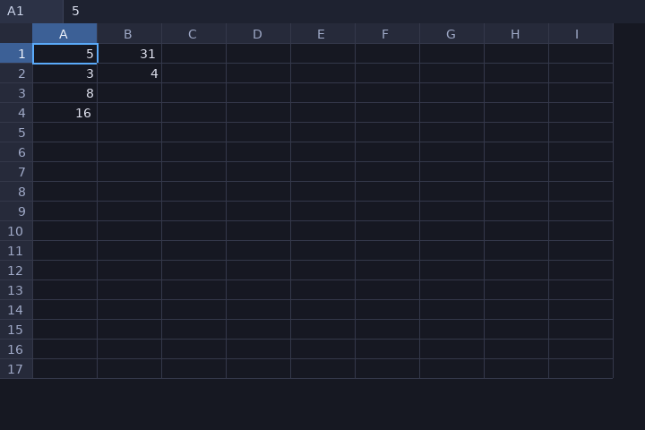

# eigen-sheet

A spreadsheet **recalc engine** written in [EigenScript](https://github.com/InauguralSystems/EigenScript):
A1-style cells, formulas (`=` arithmetic over numbers, cell references, parens,
`SUM(range)`, and text — string literals, the `&` concatenation operator, and
text functions), a dependency graph, a topological recalc, and cycle detection.
It runs standalone on the desktop and is designed for EigenOS's desktop to
import — the same `sheet.eigs`, not a private copy.



A spreadsheet is the sharpest fit for EigenScript's observer niche: a cell's
value is a function of the cells it *observes*, a change propagates along the
dependency edges, and a cycle is an observation with no fixed point — reported
as `#CYCLE` instead of looping. Editing is a replayable event stream; the same
edits in the same order reconstruct the same grid.

## Run it standalone

```sh
git clone https://github.com/InauguralSystems/EigenScript.git
make -C EigenScript gfx
EigenScript/src/eigenscript main.eigs      # opens the grid (demo sheet); Escape quits
```

## Use the engine as a library

```eigenscript
import sheet
s is sheet.new_sheet of null
sheet.set_cell of [s, "A1", "5"]
sheet.set_cell of [s, "A2", "3"]
sheet.set_cell of [s, "A3", "=A1+A2"]
sheet.set_cell of [s, "A4", "=SUM(A1:A3)"]
sheet.recalc of s
print of (sheet.get of [s, "A4"])           # -> 16
```

Importable surface: `new_sheet`, `set_cell`, `recalc`, `get`, `display`, and
`draw_grid` (the gfx front-end; `run` opens a window but is never called on
import, so `import sheet` is side-effect-free and headless-testable).

## Four oracles

A byte-diff against my own expectations is a golden master — it pins
regressions but can't say what *right* looks like. So correctness rests on
four **independent** checks:

1. **Model** (`tests/test_smoke.sh`) — replays cell edits, recalcs, and
   byte-diffs displayed values. *Self-consistency:* dependency chains, SUM,
   precedence, cycle → `#CYCLE`, topological order. Headless, no display.
2. **Differential vs a real spreadsheet** (`tests/diff_vs_calc.py` for numbers,
   `tests/diff_vs_calc_str.py` for text) — writes the same formulas to an
   `.xlsx` and byte-diffs eigen-sheet's recalc against **headless LibreOffice
   Calc**. *External truth:* for the operations every spreadsheet agrees on —
   arithmetic, precedence, cell refs, `SUM`, and on the text side `&`
   concatenation, the text functions, number↔text coercion, and
   case-insensitive text comparison — what's right is what a real, used engine
   computes, not our say-so. LibreOffice's output is the reference. (Error
   tokens like `#CYCLE`, `#VALUE!`, and div-by-zero differ across engines, so
   they stay with the model oracle.)
3. **Render** (`tests/ui_oracle.py`) — because it's a UI, renders through the
   real `draw_grid`, screenshots the window, and **decodes each cell's pixels
   back into text**, asserting they equal the model. *Render fidelity:* a cell
   drawn in the wrong place, a dropped value, a wrong glyph. Exact decode via
   the deterministic bitmap-font atlas (12×14 px cells; forced via a
   nonexistent `EIGS_GFX_FONT`), self-validated by a planted fault (blank a
   cell — must be caught).
4. **Mouse** (`tests/mouse_oracle.py`) — the grid view has mouse-driven
   controls (click a cell to select; an "Insert" dropdown that edits the
   selected cell), and a dropdown isn't verified until a real click moved real
   pixels. This drives **real xdotool pointer input** through the whole flow —
   select A4 → open the dropdown → click `=A1*A2` — and decodes the grid to
   assert A4 became 15 **and** B1 recomputed 31→29 (the mouse edit propagated
   through the dependency graph). The menu item must win the click over the
   grid cell beneath it (the popup click-trap), and a no-op drive can't pass
   (the post-click grid must differ from the untouched baseline).

```sh
EIGENSCRIPT=… bash tests/test_smoke.sh                 # model
EIGENSCRIPT=… python3 tests/diff_vs_calc.py            # numeric diff: needs libreoffice-calc + openpyxl
EIGENSCRIPT=… python3 tests/diff_vs_calc_str.py        # string diff: same deps
xvfb-run -a python3 tests/ui_oracle.py                 # render: needs gfx build + xvfb + xdotool + PIL
xvfb-run -a python3 tests/mouse_oracle.py              # mouse: same deps
```

CI runs `test`, `calc-oracle`, and `ui-oracle` (which runs both the render and
mouse oracles).

## Scope

Numbers, `+ - * /`, parens and precedence, comparisons (`> < >= <= = <>`),
cell references, multi-letter columns, numeric functions `SUM` / `AVERAGE`
(`AVG`) / `MIN` / `MAX` over a range and `IF(cond, then, else)` (nestable),
dependency-ordered recalc, cycle detection. **Text:** string literals
(`"..."`, `""` escapes a quote), the `&` concatenation operator (looser than
arithmetic, tighter than comparison, coercing numbers to text so `=5&"x"` is
`5x`), the text functions `LEN` / `UPPER` / `LOWER` / `TRIM` / `LEFT` /
`RIGHT` / `MID` / `CONCATENATE`, case-insensitive text comparison (`="a"="A"`
is true), and number↔text coercion (non-numeric text in arithmetic is
`#VALUE!`). Text left-aligns, numbers right-align. Interactive: in-cell editing
with a formula bar, click-drag range selection with a live Sum/Average/Count
status bar, copy/paste with relative-reference adjustment (`Ctrl+C`/`V`),
undo/redo (`Ctrl+Z`/`Y`), and delete-to-clear. Not yet: menus/toolbar,
scrollbars, sheet tabs.

## License

MIT — see [LICENSE](LICENSE).
